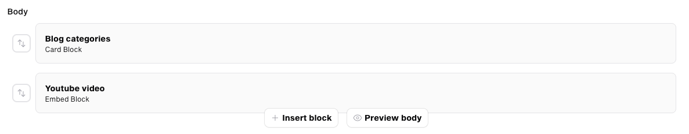

# Architect field for Filament

## Introduction

The Architect field is an optimised and improved version of the default Builder field. The form is not inline, but in a modal, this way the main form is not bloated anymore if there is a large amount of selected blocks.

These blocks are also reusable, so the schema for these blocks don't have to be rewritten every time.



Next to that it's also possible to add templates and re-use them in your records.

## Installation

First, install this package via the Composer package manager:

```bash
composer require wotz/filament-architect
```

In an effort to align with Filament's theming methodology you will need to use a custom theme to use this plugin.

> **Note**
> If you have not set up a custom theme and are using a Panel follow the instructions in the [Filament Docs](https://filamentphp.com/docs/3.x/panels/themes#creating-a-custom-theme) first. The following applies to both the Panels Package and the standalone Forms package.

1. Add the plugin's views to your `tailwind.config.js` file.

```js
content: [
    ...
    './vendor/wotz/filament-architect/resources/**/*.blade.php',
]
```

Register the plugin in your Panel provider:

```php
public function panel(Panel $panel): Panel
{
    return $panel
        ->plugins([
            \Wotz\FilamentArchitect\Filament\ArchitectPlugin::make(),
        ]);
    }
```

### Publish the config file

You can publish the config file with:

```bash
php artisan vendor:publish --tag="filament-architect-config"
```

This is the contents of the published config file:

```php
return [
    'default-blocks' => [
        \Wotz\FilamentArchitect\Filament\Architect\ButtonBlock::class,
        \Wotz\FilamentArchitect\Filament\Architect\CardBlock::class,
        \Wotz\FilamentArchitect\Filament\Architect\CtaBlock::class,
        \Wotz\FilamentArchitect\Filament\Architect\EmbedBlock::class,
        \Wotz\FilamentArchitect\Filament\Architect\MediaBlock::class,
        \Wotz\FilamentArchitect\Filament\Architect\MediaTextBlock::class,
        \Wotz\FilamentArchitect\Filament\Architect\SliderBlock::class,
        \Wotz\FilamentArchitect\Filament\Architect\SpacerBlock::class,
        \Wotz\FilamentArchitect\Filament\Architect\TableBlock::class,
        \Wotz\FilamentArchitect\Filament\Architect\TextBlock::class,
        \Wotz\FilamentArchitect\Filament\Architect\VideoBlock::class,
        \Wotz\FilamentArchitect\Filament\Architect\VideoTextBlock::class,
    ],
    'enableDuplicateButton' => false,
    'enableShownButton' => false,
    'widthOptions' => \Wotz\FilamentArchitect\Enums\WidthOptions::class,
    'buttonClasses' => [
        'btn btn-primary' => 'Primary button',
        'btn btn-link' => 'Text',
    ],
    'trackingActions' => ['hit', 'play', 'pause', 'download', 'view', 'open', 'close'],
    'attachmentFormats' => [
        \Wotz\MediaLibrary\Formats\Thumbnail::class,
    ],
];
```

## Adding new blocks

To add new blocks, you can extend `\Wotz\FilamentArchitect\Filament\Architect\BaseBlock`.
You have to add a `schema` and a `render` function.

In the schema array you can add [Filament fields](https://filamentphp.com/docs/3.x/forms/fields/getting-started).

```php
public function schema(): array
{
    return [];
}
```

In the render function you can return the view that will be rendered in the front-end.

```php
public function render(array $data): ?View
{
    return view('architect.button-block', [
        'buttons' => collect($data['buttons'])->pluck('button'),
        'alignment' => $data['alignment'] ?? 'left',
    ]);
}
```

Or you can also create both with our artisan command:

```bash
php artisan make:architect-block ButtonBlock
```

## Rendering Architect

To render Architect you can add an attribute in your model:

```php
public function getBodyAttribute($value): \Wotz\FilamentArchitect\Engines\Architect|string
{
    return \Wotz\FilamentArchitect\Engines\Architect::make($value);
}
```

We return an Architect or string, because Filament needs a string to be able to fill the field with the existing data.

In the blade file you can then add:

```blade
{{ $post->body }}
```

## Components

We provide some components that you can use in your blocks.

### ButtonComponent

This will render a button that opens a modal where you can fill in fields to show a button in the block.
This integrates with our [wotz/filament-link-picker](https://github.com/wotzebra/filament-link-picker) package.

```php
\Wotz\FilamentArchitect\Filament\Components\ButtonComponent::make('button')
```

## Config

### Default blocks

Here you can set the default blocks that will be shown by default in all Architect fields.
This must be an array.

Default value:

```php
[
    \Wotz\FilamentArchitect\Filament\Architect\ButtonBlock::class,
    \Wotz\FilamentArchitect\Filament\Architect\CardBlock::class,
    \Wotz\FilamentArchitect\Filament\Architect\CtaBlock::class,
    \Wotz\FilamentArchitect\Filament\Architect\EmbedBlock::class,
    \Wotz\FilamentArchitect\Filament\Architect\MediaBlock::class,
    \Wotz\FilamentArchitect\Filament\Architect\MediaTextBlock::class,
    \Wotz\FilamentArchitect\Filament\Architect\SliderBlock::class,
    \Wotz\FilamentArchitect\Filament\Architect\SpacerBlock::class,
    \Wotz\FilamentArchitect\Filament\Architect\TableBlock::class,
    \Wotz\FilamentArchitect\Filament\Architect\TextBlock::class,
    \Wotz\FilamentArchitect\Filament\Architect\VideoBlock::class,
    \Wotz\FilamentArchitect\Filament\Architect\VideoTextBlock::class,
]
```

### enableDuplicateButton

Enables or disables (disabled by default) the "duplicate" action for the Architect, allowing the user to duplicate rows easily.
You can also enable/disable this feature on the input itself:

```php
ArchitectInput::make('body')
    ->hasDuplicateAction(true),
```

### enableShownButton
When set to `true`, this will enable a new button in the CMS that allows the user to disable a block in the front-end, without having to delete it. The block will still be editable/sortable/etc. even when disabled.

### widthOptions

This is an enum where you can set the width options for some blocks.
If you don't want to use this enum and hide the field, you can set it to null.

Default value:

```php
\Wotz\FilamentArchitect\Enums\WidthOptions::class
```

### buttonClasses

Here you can set the button classes that will be shown in the button component.
This must be an array or a reference to an enum class.

Default value:

```php
[
    'btn btn-primary' => 'Primary button',
    'btn btn-link' => 'Text',
]
```

#### Enum

If you want to use an enum, you can create one like this:

```php
<?php

namespace App\Enums;

use Filament\Support\Contracts\HasLabel;

enum ButtonClasses: string implements HasLabel
{
    case Primary = 'primary';
    case Text = 'text';

    public function getLabel(): ?string
    {
        return match ($this) {
            self::Primary => 'Primary button',
            self::Text => 'Text',
        };
    }

    public function getCssClass(): string
    {
        return match ($this) {
            self::Primary => 'btn btn-primary',
            self::Text => 'btn btn-link',
        };
    }
}
```

And set it in the config:

```php
'buttonClasses' => \App\Enums\ButtonClasses::class,
```


### trackingActions

Here you can set the tracking actions that will be shown in the button component.
This must be an array.

Default value:

```php
[
    'hit',
    'play',
    'pause',
    'download',
    'view',
    'open',
    'close'
]
```

### attachmentFormats

Since AttachmentInput fields are not immediately related to a model, we have to define the formats for each AttachmentInput field manually.
This can be done via this config.

If you add your own block, don't forget to add the `allowedFormats` method to the AttachmentInput field with our helper.

```php
AttachmentInput::make('image')
    ->allowedFormats(ArchitectFormats::get())
```

## Filament

### Architect Field

To use the Architect field in Filament you can add it to your resource:

```php
return [
    \Wotz\FilamentArchitect\Filament\Fields\Architect::make('body'),
];
```

#### Methods

To modify the blocks we provide some custom blocks.

##### excludedBlocks(array $blocksToExclude): ArchitectInput

With this method you can exclude default blocks from the Architect field.

```php
return [
    \Wotz\FilamentArchitect\Filament\Fields\PageArchitectInput::make('body')
        ->excludedBlocks([
            \Wotz\FilamentArchitect\Filament\Architect\ButtonBlock::make(),
        ]),
];
```

##### addBlocks(array $blocksToAdd): ArchitectInput

With this method you can add blocks to the Architect field.

```php
return [
    \Wotz\FilamentArchitect\Filament\Fields\Architect::make('body')
        ->addBlocks([
            \App\Architect\CustomBlock::class,
        ]),
];
```

##### blocks(array $blocks): ArchitectInput

With this method you can overwrite all default blocks on the Architect field.

```php
return [
    \Wotz\FilamentArchitect\Filament\Fields\Architect::make('body')
        ->blocks([
            \App\Architect\CustomBlock::class,
        ]),
];
```

##### maxFieldsPerRow(null|int|Closure $maxFieldsPerRow): ArchitectInput

With this you can set the maximum amount of fields per row.

```php
return [
    \Wotz\FilamentArchitect\Filament\Fields\Architect::make('body')
        ->maxFieldsPerRow(1),
];
```

##### hasTemplates(Closure|bool $hasTemplates): ArchitectInput

With this you can enable or disable the "Start from template" action. Defaults to true.

```php
return [
    \Wotz\FilamentArchitect\Filament\Fields\Architect::make('body')
        ->hasTemplates(false),
];
```

##### hasPreview(Closure|bool $hasPreview): ArchitectInput

With this you can enable or disable the "Preview" action. Defaults to true.

```php
return [
    \Wotz\FilamentArchitect\Filament\Fields\Architect::make('body')
        ->hasPreview(false),
];
```
